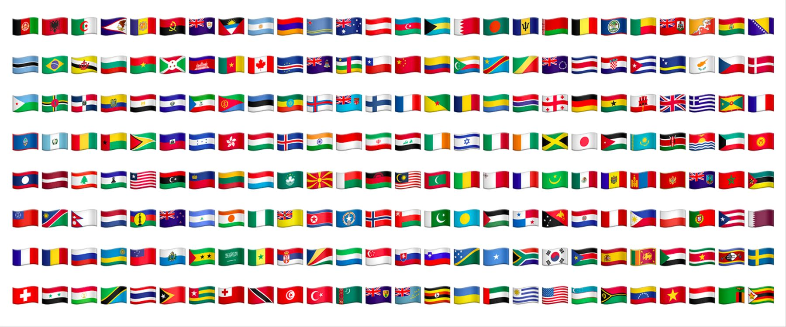

# Flags
🇸🇪 Flag extension


[](http://cocoapods.org/pods/Flags)
[](http://cocoapods.org/pods/Flags)
[](http://cocoapods.org/pods/Flags)
[](https://github.com/Carthage/Carthage)



## Usage
```swift
let flag = Flag(countryCode: "SE")

let countryLabel = UILabel()
countryLabel.text = flag?.emoji // 🇸🇪

let countryImage = UIImageView()
countryImage.image = flag?.image // 🇸🇪 to image
```

## Requirements
Flags is written in  Xcode 10, Swift 4.2, iOS 8.0 Required

## 📲 Installation
Flags is available through [Cocoapods](http://cocoapods.org) or [Carthage](https://github.com/Carthage/Carthage).

### Cocoapods
```ruby
pod "Flags"
```

### Carthage
```
github "cruisediary/Flags" ~> 0.2.1
```

## ❤️ Contribution
Pull requests are always welcomed 🏄🏼

## 👨‍💻 Author
cruz, cruzdiary@gmail.com

## 🛡 License

Flags is available under the MIT license. See the LICENSE file for more info.
